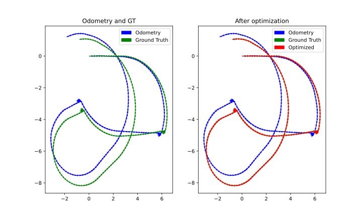
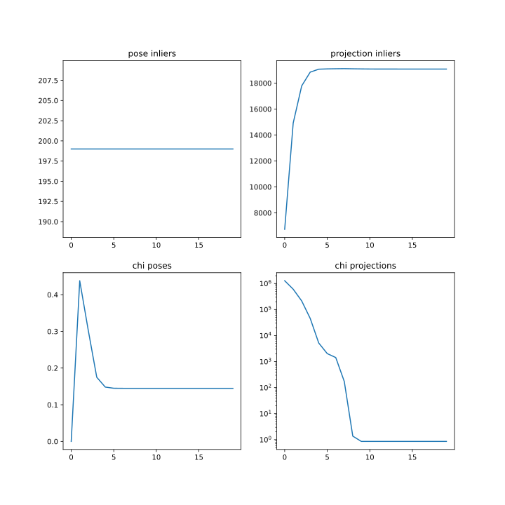
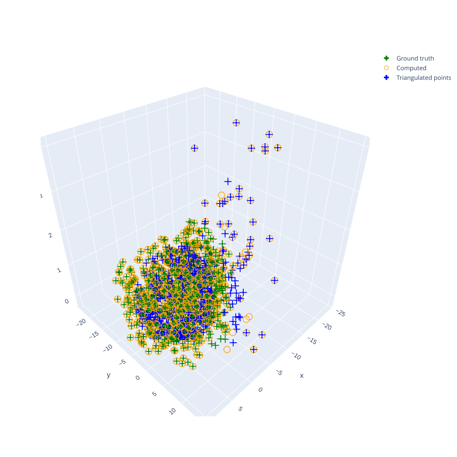

# Planar Monocular Slam
Probabilistic Robotics Project:
This repository implements a bundle adjustment system for optimizing robot
poses and landmark positions. The optimization is performed using a total
least squares, with odometry and projection constraints.
The resulting graphs svg and an html page with a representation of the
landmarks (see Results) can be found in the output directory,


## Instructions
- \(OPTIONAL\) Create a conda environment
    ```
    conda create -n probrob python=3.9
    conda activate probrob
    ```
- Install the dependencies
    ```
    pip install -r requirements.txt
    ```
- Start the program by running
    ```
    python main.py
    ```

## Results
### Odometry

### Residuals and inliers

### Landmark visualization



